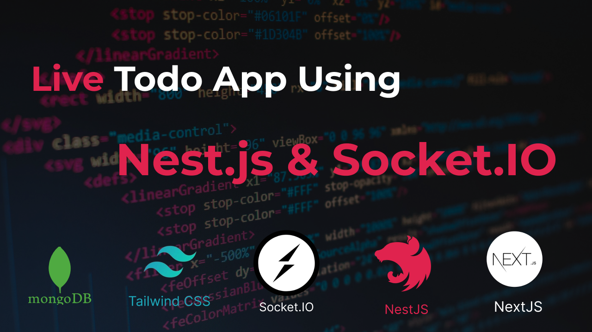

# **Todo Keep Real Time 🚀**

> A real-time task management application built with **NestJS**, **Socket.IO**, **Next.js**, and **MongoDB**. Collaborate and manage tasks across boards in real time – create, update, delete, and mark tasks as complete — all without refreshing!

---


## 🎥 Watch on YouTube

🔗 [Insert your YouTube video link here]  
📌 Want to see how it works? Check out the full tutorial on YouTube!

---

## 💡 Introduction

**Todo Keep Real Time** is a collaborative task management app that allows users to:

- Create and manage **boards**
- Add, edit, and delete **tasks within boards**
- Mark tasks as **completed or not completed**
- All changes are reflected **in real time** using **WebSocket (Socket.IO)**

This project is perfect for learning:
- NestJS for building scalable Node.js applications
- Real-time communication with Socket.IO
- MongoDB for flexible data modeling
- Next.js for SSR/SSG and client-side interactivity

---

## 🔧 Technologies Used

| Tech Stack        | Description |
|------------------|-------------|
| **Frontend**     | Next.js + React |
| **Backend**      | NestJS + Socket.IO |
| **Database**     | MongoDB |
| **Real-Time**    | WebSocket via Socket.IO |
| **Styling**      | Tailwind CSS |

---

## 📦 Features

### 📋 Boards
- Create new boards
- Delete boards
- Edit board names
- Real-time updates across clients

### ✅ Tasks
- Add new tasks to any board
- Edit task title
- Delete tasks
- Mark tasks as **Completed / Not Completed**
- All changes sync instantly for all connected users

### ⚡ Real-Time Sync
- Powered by **Socket.IO** in NestJS backend
- Frontend listens and updates UI in real time
- No need to refresh the page

---

## 🧪 Installation & Setup

### 1. Clone the repo
```bash
git clone git@github.com:dappsmartdev/todokeep.git
cd todo-keep-realtime
```

### run this commands for nestjs project please

```bash
# Tasks Module
nest generate module tasks
nest generate controller tasks
nest generate service tasks
nest generate dto tasks/create-task

# Boards Module
nest generate module boards
nest generate controller boards
nest generate service boards
nest generate dto boards/create-board

# Upload Module
nest generate module upload
nest generate controller upload
nest generate service upload

# Socket Module & Gateways
nest generate module socket
nest generate gateway socket
nest generate gateway events --no-spec

# Manually create schema and utility files
touch src/tasks/task.schema.ts
touch src/boards/board.schema.ts
touch src/socket-io.adapter.ts
mkdir -p src/utils && touch src/utils/connectDB.ts

```
### 🛠️ Folder Structure


```bash

todokeep/
├── todokeep-api/         # NestJS server with Socket.IO
│   ├── src/
│   │   ├── main.ts
│   │   ├── socket/
│   │   ├── boards/
│   │   ├── tasks/
│   │   └── utils/
│   └── ...
├── todokeep-nextjs/        # Next.js App
│   ├── pages/
│   ├── components/
│   ├── public/
│   └── ...
└── README.md

```